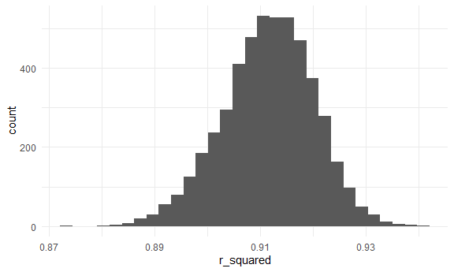
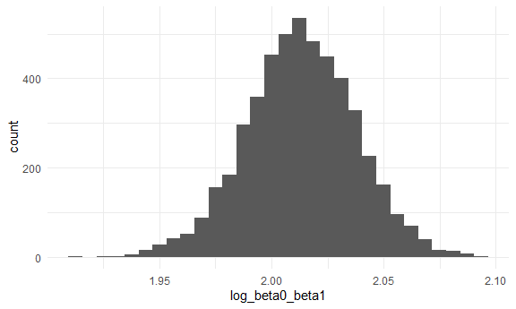
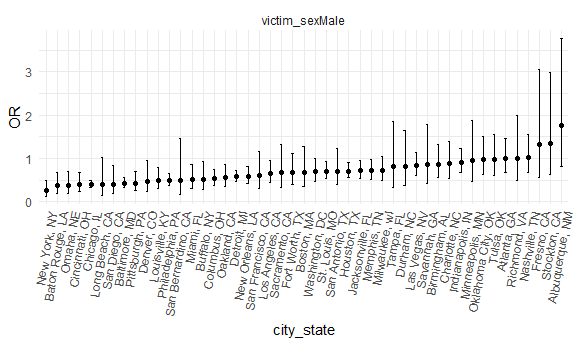
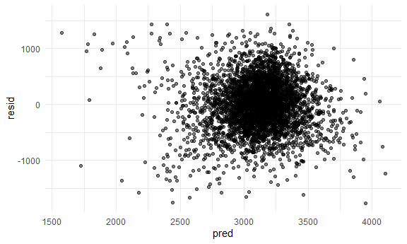
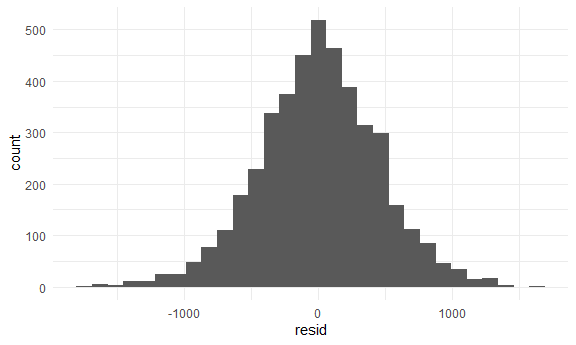
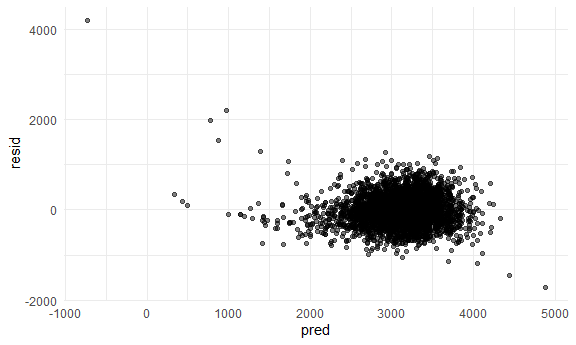
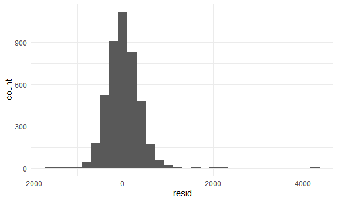
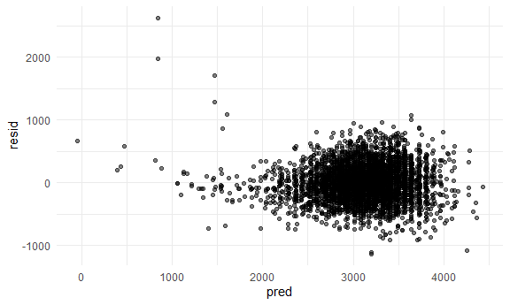
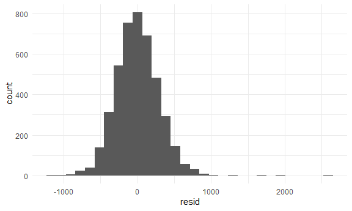
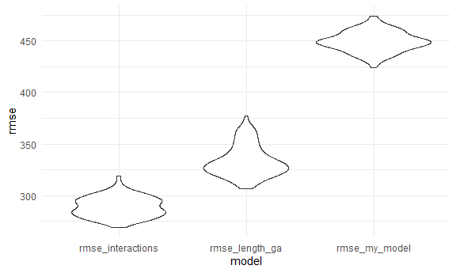

p8105_hw6_cm3341
================
Carolina Montes Garcia
2024-12-02

- [Problem 1](#problem-1)
- [Problem 2](#problem-2)
- [Problem 3](#problem-3)

## Problem 1

Import data

``` r
weather_df = 
  rnoaa::meteo_pull_monitors(
    c("USW00094728"),
    var = c("PRCP", "TMIN", "TMAX"), 
    date_min = "2017-01-01",
    date_max = "2017-12-31") %>%
  mutate(
    name = recode(id, USW00094728 = "CentralPark_NY"),
    tmin = tmin / 10,
    tmax = tmax / 10) %>%
  select(name, id, everything())
```

    ## using cached file: C:\Users\Gummbunn\AppData\Local/R/cache/R/rnoaa/noaa_ghcnd/USW00094728.dly

    ## date created (size, mb): 2024-11-30 18:27:07.290209 (8.685)

    ## file min/max dates: 1869-01-01 / 2024-11-30

I broke down the steps of this problem, probably more than what the
professor wants, but I had to in order to understand what I was doing.

First, I set up bootstrap samples, fit the model, extract r squared and
computer log (B0\*B1). B0 is the y intercept and B1 is the slope.

``` r
set.seed(41)

bootstrap_samples = 
  weather_df %>% 
  modelr::bootstrap(n = 5000) 

bootstrap_results = 
  bootstrap_samples %>% 
  mutate(
    models = map(strap, \(df) lm(tmax ~ tmin, data = df)),
    r_squared = map_dbl(models, \(mod) broom::glance(mod)$r.squared),
    log_beta0_beta1 = map_dbl(models, \(mod) {
      coef_estimates = broom::tidy(mod) %>% 
        select(term, estimate) %>% 
        pivot_wider(names_from = term, values_from = estimate)
      log(coef_estimates$`(Intercept)` * coef_estimates$tmin)
    })
  )

head(bootstrap_results)
```

    ## # A tibble: 6 × 5
    ##   strap                .id   models r_squared log_beta0_beta1
    ##   <list>               <chr> <list>     <dbl>           <dbl>
    ## 1 <resample [365 x 6]> 0001  <lm>       0.903            2.06
    ## 2 <resample [365 x 6]> 0002  <lm>       0.916            1.99
    ## 3 <resample [365 x 6]> 0003  <lm>       0.908            1.98
    ## 4 <resample [365 x 6]> 0004  <lm>       0.918            2.03
    ## 5 <resample [365 x 6]> 0005  <lm>       0.908            2.03
    ## 6 <resample [365 x 6]> 0006  <lm>       0.907            2.01

calculate confidence intervals for each statistic and add them to the
dataframe

``` r
bootstrap_results = 
  bootstrap_results %>%
  mutate(
    r_squared_ci_lower = quantile(r_squared, 0.025),
    r_squared_ci_upper = quantile(r_squared, 0.975),
    log_beta0_beta1_ci_lower = quantile(log_beta0_beta1, 0.025),
    log_beta0_beta1_ci_upper = quantile(log_beta0_beta1, 0.975)
  )

head(bootstrap_results)
```

    ## # A tibble: 6 × 9
    ##   strap                .id   models r_squared log_beta0_beta1 r_squared_ci_lower
    ##   <list>               <chr> <list>     <dbl>           <dbl>              <dbl>
    ## 1 <resample [365 x 6]> 0001  <lm>       0.903            2.06              0.893
    ## 2 <resample [365 x 6]> 0002  <lm>       0.916            1.99              0.893
    ## 3 <resample [365 x 6]> 0003  <lm>       0.908            1.98              0.893
    ## 4 <resample [365 x 6]> 0004  <lm>       0.918            2.03              0.893
    ## 5 <resample [365 x 6]> 0005  <lm>       0.908            2.03              0.893
    ## 6 <resample [365 x 6]> 0006  <lm>       0.907            2.01              0.893
    ## # ℹ 3 more variables: r_squared_ci_upper <dbl>, log_beta0_beta1_ci_lower <dbl>,
    ## #   log_beta0_beta1_ci_upper <dbl>

Distribution plots

``` r
bootstrap_results %>%
  ggplot(aes(x = r_squared)) +
  geom_histogram(bins = 30)
```



``` r
bootstrap_results %>%
  ggplot(aes(x = log_beta0_beta1)) +
  geom_histogram(bins = 30)
```



The r.squared and log(B0\*B1) statistics in the bootstrap samples seem
to be relatively normally distributed.

## Problem 2

Import csv data from the Washington Post GitHub Repository. This dataset
includes data on homicides in 50 large US cities. Tidy the data using
the code from the class example that used the same dataset.

``` r
cities_df = 
  read_csv("data/homicide-data.csv") %>%  
  mutate(
    city_state = paste(city, state, sep = ", "),
    resolved = as.numeric(disposition == "Closed by arrest"),
    victim_age = as.numeric(victim_age)) %>%  
  filter(
    !(city_state %in% c("Dallas, TX", "Phoenix, AZ", "Kansas City, MO", "Tulsa, AL")),  # Exclude specified cities
    victim_race %in% c("White", "Black")
  ) %>% 
  select(city_state, resolved, victim_age, victim_race, victim_sex) 
```

    ## Rows: 52179 Columns: 12
    ## ── Column specification ────────────────────────────────────────────────────────
    ## Delimiter: ","
    ## chr (9): uid, victim_last, victim_first, victim_race, victim_age, victim_sex...
    ## dbl (3): reported_date, lat, lon
    ## 
    ## ℹ Use `spec()` to retrieve the full column specification for this data.
    ## ℹ Specify the column types or set `show_col_types = FALSE` to quiet this message.

    ## Warning: There was 1 warning in `mutate()`.
    ## ℹ In argument: `victim_age = as.numeric(victim_age)`.
    ## Caused by warning:
    ## ! NAs introduced by coercion

Fit logistic regression for `city_state` Baltimore, MD.

``` r
fit_logistic = 
  cities_df %>%  
  filter(city_state == "Baltimore, MD") %>% 
  glm(resolved ~ victim_age + victim_race + victim_sex, data = ., family = binomial()) 
```

Run `broom::tidy`

``` r
fit_logistic %>%  
  broom::tidy(conf.int = TRUE) %>%  
  filter(term == "victim_sexMale") %>%
  mutate(OR = exp(estimate)) %>% 
  select(term, log_OR = estimate, OR, p.value, conf.low = conf.low, 
    conf.high = conf.high) %>%  
  knitr::kable(digits = 3)
```

| term           | log_OR |    OR | p.value | conf.low | conf.high |
|:---------------|-------:|------:|--------:|---------:|----------:|
| victim_sexMale | -0.854 | 0.426 |       0 |   -1.126 |    -0.584 |

Interpretation: The odds of solving a homicide for male victims are
42.6% of the odds for female victims, keeping other variables constant.

Glm and nesting for all other cities

``` r
nest_lm_cities = 
  cities_df %>% 
  nest(data = -city_state) %>%
  mutate(
    models = map(data, ~glm(resolved ~ victim_age + victim_race + victim_sex, data = .x, family = binomial())),
    results = map(models, ~broom::tidy(.x, conf.int = TRUE))
  ) %>% 
  select(city_state, results) %>% 
  unnest(cols = results) %>% 
  filter(term == "victim_sexMale") %>% 
  mutate(OR = exp(estimate))
```

    ## Warning: There were 45 warnings in `mutate()`.
    ## The first warning was:
    ## ℹ In argument: `results = map(models, ~broom::tidy(.x, conf.int = TRUE))`.
    ## Caused by warning:
    ## ! glm.fit: fitted probabilities numerically 0 or 1 occurred
    ## ℹ Run `dplyr::last_dplyr_warnings()` to see the 44 remaining warnings.

Plot showing the estimated ORs and CIs for each city for solving
homicides comparing male victims to female victims.

``` r
nest_lm_cities %>% 
  arrange(OR) %>%
  mutate(city_state = fct_reorder(city_state, OR)) %>%
  ggplot(aes(x = city_state, y = OR)) +
  geom_point() + 
  facet_wrap(~term) + 
  geom_errorbar(aes(ymin = exp(conf.low), ymax = exp(conf.high)), width = 0.2)+
  theme(axis.text.x = element_text(angle = 80, hjust = 1))
```



Plot interpretation: In this plot, we see that the majority of the
points (representing adjusted ORs) fall below 1, a handful of points
fall right about 1, and just 3-4 points fall above 1. Points that fall
below 1 indicate that male victims in those cities have lower odds to
have their homicides resolved compared to female victims, after
accounting for victim age and race. Points that fall right around 1
indicate no real difference between the likelihood of male or female
victims having their homicide cases resolved, after accounting for
victim age and race. Points that fall above 1 indicate that male victims
have higher odds of having their homicides resolved compared to female
victims, after accounting for victim age and race.

It is worth noting, however, that many of the confidence intervals cross
1, indicating that the adjusted ORs for those cities were not found to
be statistically significant.

## Problem 3

Import and clean data

``` r
bwt_df = 
  read_csv("data/birthweight.csv",  
  na = c("NA", "."))%>%
  drop_na() %>% 
  mutate(
    babysex = factor(babysex, levels = c(1, 2), labels = c("Male", "Female")),
    frace = factor(frace, levels = c(1, 2, 3, 4, 8, 9), 
                   labels = c("White", "Black", "Asian", "Puerto Rican", "Other", "Unknown")),
    malform = factor(malform, levels = c(0, 1), labels = c("Absent", "Present")),
    mrace = factor(mrace, levels = c(1, 2, 3, 4, 8), 
                   labels = c("White", "Black", "Asian", "Puerto Rican", "Other"))
  )
```

    ## Rows: 4342 Columns: 20
    ## ── Column specification ────────────────────────────────────────────────────────
    ## Delimiter: ","
    ## dbl (20): babysex, bhead, blength, bwt, delwt, fincome, frace, gaweeks, malf...
    ## 
    ## ℹ Use `spec()` to retrieve the full column specification for this data.
    ## ℹ Specify the column types or set `show_col_types = FALSE` to quiet this message.

Based on risk factors that can contribute to low birth weight listed on
the cleveland clinic website
(<https://my.clevelandclinic.org/health/diseases/24980-low-birth-weight>),
I chose to model gestational age in weeks, mother’s weight at delivery,
and mother’s age at delivery as predictors of birth weight.

Fit my proposed linear model.

``` r
my_mod = lm(bwt ~ gaweeks + delwt + momage, data = bwt_df)
summary(my_mod)
```

    ## 
    ## Call:
    ## lm(formula = bwt ~ gaweeks + delwt + momage, data = bwt_df)
    ## 
    ## Residuals:
    ##      Min       1Q   Median       3Q      Max 
    ## -1767.61  -284.30     4.69   290.50  1610.74 
    ## 
    ## Coefficients:
    ##              Estimate Std. Error t value Pr(>|t|)    
    ## (Intercept) -275.6856    95.1635  -2.897  0.00379 ** 
    ## gaweeks       60.7630     2.1888  27.761  < 2e-16 ***
    ## delwt          5.4374     0.3097  17.555  < 2e-16 ***
    ## momage         9.9957     1.7716   5.642 1.79e-08 ***
    ## ---
    ## Signif. codes:  0 '***' 0.001 '**' 0.01 '*' 0.05 '.' 0.1 ' ' 1
    ## 
    ## Residual standard error: 448.9 on 4338 degrees of freedom
    ## Multiple R-squared:  0.2324, Adjusted R-squared:  0.2319 
    ## F-statistic: 437.8 on 3 and 4338 DF,  p-value: < 2.2e-16

``` r
bwt_df = 
  bwt_df %>%
  modelr::add_predictions(my_mod) %>%
  modelr::add_residuals(my_mod)


bwt_df %>%
  ggplot(aes(x = pred, y = resid)) +
  geom_point(alpha = 0.5)
```



``` r
bwt_df %>%
  ggplot(aes(x = resid)) +
  geom_histogram(bins = 30)
```


The residuals seem to follow a normal distribution, therefore, I can
feel confident in my use of a linear regression model.

Next, I will create the two other models requested:

- One using length at birth and gestational age as predictors (main
  effects only)

\*One using head circumference, length, sex, and all interactions
(including the three-way interaction) between these

Model for length at birth and gestational age as predictors as
predictors of birth weight. Check for normality.

``` r
length_ga_mod = lm(bwt ~ blength + gaweeks, data = bwt_df)
summary(length_ga_mod)
```

    ## 
    ## Call:
    ## lm(formula = bwt ~ blength + gaweeks, data = bwt_df)
    ## 
    ## Residuals:
    ##     Min      1Q  Median      3Q     Max 
    ## -1709.6  -215.4   -11.4   208.2  4188.8 
    ## 
    ## Coefficients:
    ##              Estimate Std. Error t value Pr(>|t|)    
    ## (Intercept) -4347.667     97.958  -44.38   <2e-16 ***
    ## blength       128.556      1.990   64.60   <2e-16 ***
    ## gaweeks        27.047      1.718   15.74   <2e-16 ***
    ## ---
    ## Signif. codes:  0 '***' 0.001 '**' 0.01 '*' 0.05 '.' 0.1 ' ' 1
    ## 
    ## Residual standard error: 333.2 on 4339 degrees of freedom
    ## Multiple R-squared:  0.5769, Adjusted R-squared:  0.5767 
    ## F-statistic:  2958 on 2 and 4339 DF,  p-value: < 2.2e-16

``` r
bwt_df %>%
  modelr::add_predictions(length_ga_mod) %>%
  modelr::add_residuals(length_ga_mod) %>%
  ggplot(aes(x = pred, y = resid))+
  geom_point(alpha = 0.5)
```



``` r
bwt_df %>%
  modelr::add_predictions(length_ga_mod) %>%
  modelr::add_residuals(length_ga_mod) %>%
  ggplot(aes(x = resid)) +
  geom_histogram(bins = 30)
```


There seem to be some outliers on the upper end of the distribution. The
histogram is quite narrow as well.

Model for head circumference, baby length, baby sex, and all
interactions as predictors of birth weight

``` r
interactions_model = lm(bwt ~ bhead * blength * babysex, data = bwt_df)
summary(interactions_model)
```

    ## 
    ## Call:
    ## lm(formula = bwt ~ bhead * blength * babysex, data = bwt_df)
    ## 
    ## Residuals:
    ##      Min       1Q   Median       3Q      Max 
    ## -1132.99  -190.42   -10.33   178.63  2617.96 
    ## 
    ## Coefficients:
    ##                               Estimate Std. Error t value Pr(>|t|)    
    ## (Intercept)                 -7176.8170  1264.8397  -5.674 1.49e-08 ***
    ## bhead                         181.7956    38.0542   4.777 1.84e-06 ***
    ## blength                       102.1269    26.2118   3.896 9.92e-05 ***
    ## babysexFemale                6374.8684  1677.7669   3.800 0.000147 ***
    ## bhead:blength                  -0.5536     0.7802  -0.710 0.478012    
    ## bhead:babysexFemale          -198.3932    51.0917  -3.883 0.000105 ***
    ## blength:babysexFemale        -123.7729    35.1185  -3.524 0.000429 ***
    ## bhead:blength:babysexFemale     3.8781     1.0566   3.670 0.000245 ***
    ## ---
    ## Signif. codes:  0 '***' 0.001 '**' 0.01 '*' 0.05 '.' 0.1 ' ' 1
    ## 
    ## Residual standard error: 287.7 on 4334 degrees of freedom
    ## Multiple R-squared:  0.6849, Adjusted R-squared:  0.6844 
    ## F-statistic:  1346 on 7 and 4334 DF,  p-value: < 2.2e-16

``` r
bwt_df %>%
  modelr::add_predictions(interactions_model) %>%
  modelr::add_residuals(interactions_model) %>%
  ggplot(aes(x = pred, y = resid)) +
  geom_point(alpha = 0.5)
```



``` r
bwt_df %>%
  modelr::add_predictions(interactions_model) %>%
  modelr::add_residuals(interactions_model) %>%
  ggplot(aes(x = resid)) +
  geom_histogram(bins = 30)
```


Likewise, this distribution also shows some outliers on the upper end
and still a very narrow distribution around 0.

Now I will compare these models and my original model through
cross-validation

``` r
cv_df = crossv_mc(bwt_df, n = 100)
```

``` r
cv_df = 
  cv_df %>% 
  mutate(
    my_model = map(train, \(df) lm(bwt ~ gaweeks + delwt + momage, data = df)),
    length_ga_mod = map(train, \(df) lm(bwt ~ blength + gaweeks, data = df)),
    interactions_model = map(train, \(df) lm(bwt ~ bhead * blength * babysex, data = df))
  ) %>%
  mutate(
    rmse_my_model = map2_dbl(my_model, test, \(mod, df) rmse(model = mod, data = df)),
    rmse_length_ga = map2_dbl(length_ga_mod, test, \(mod, df) rmse(model = mod, data = df)),
    rmse_interactions = map2_dbl(interactions_model, test, \(mod, df) rmse(model = mod, data = df))
  )
```

RMSE

``` r
cv_summary = cv_df %>%
  select(starts_with("rmse")) %>%
  pivot_longer(
    everything(),
    names_to = "model",
    values_to = "rmse"
  ) %>%
  group_by(model) %>%
  summarize(
    mean_rmse = mean(rmse),
    sd_rmse = sd(rmse)
  )

cv_summary %>%
  knitr::kable(digits = 3)
```

| model             | mean_rmse | sd_rmse |
|:------------------|----------:|--------:|
| rmse_interactions |   288.933 |   9.857 |
| rmse_length_ga    |   333.200 |  15.109 |
| rmse_my_model     |   449.273 |   9.771 |

RMSE plot

``` r
cv_df %>%
  select(starts_with("rmse")) %>%
  pivot_longer(
    everything(),
    names_to = "model",
    values_to = "rmse"
  ) %>%
  ggplot(aes(x = model, y = rmse)) +
  geom_violin()
```



The `interactions_model` shows both a lower mean RMSE and smaller SD,
both indicators of a better prediction model.
