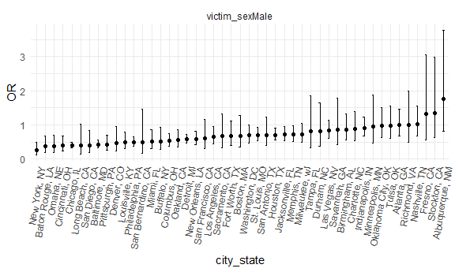

p8105_hw6_cm3341
================
Carolina Montes Garcia
2024-11-30

- [Problem 1](#problem-1)
- [Problem 2](#problem-2)
- [Problem 3](#problem-3)

## Problem 1

Import data

``` r
weather_df = 
  rnoaa::meteo_pull_monitors(
    c("USW00094728"),
    var = c("PRCP", "TMIN", "TMAX"), 
    date_min = "2017-01-01",
    date_max = "2017-12-31") %>%
  mutate(
    name = recode(id, USW00094728 = "CentralPark_NY"),
    tmin = tmin / 10,
    tmax = tmax / 10) %>%
  select(name, id, everything())
```

    ## using cached file: C:\Users\Gummbunn\AppData\Local/R/cache/R/rnoaa/noaa_ghcnd/USW00094728.dly

    ## date created (size, mb): 2024-11-30 18:27:07.290209 (8.685)

    ## file min/max dates: 1869-01-01 / 2024-11-30

## Problem 2

Import csv data from the Washington Post GitHub Repository. This dataset
includes data on homicides in 50 large US cities. Tidy the data using
the code from the class example that used the same dataset.

``` r
cities_df = 
  read_csv("data/homicide-data.csv") %>%  
  mutate(
    city_state = paste(city, state, sep = ", "),
    resolved = as.numeric(disposition == "Closed by arrest"),
    victim_age = as.numeric(victim_age)) %>%  
  filter(
    !(city_state %in% c("Dallas, TX", "Phoenix, AZ", "Kansas City, MO", "Tulsa, AL")),  # Exclude specified cities
    victim_race %in% c("White", "Black")
  ) %>% 
  select(city_state, resolved, victim_age, victim_race, victim_sex) 
```

    ## Rows: 52179 Columns: 12
    ## ── Column specification ────────────────────────────────────────────────────────
    ## Delimiter: ","
    ## chr (9): uid, victim_last, victim_first, victim_race, victim_age, victim_sex...
    ## dbl (3): reported_date, lat, lon
    ## 
    ## ℹ Use `spec()` to retrieve the full column specification for this data.
    ## ℹ Specify the column types or set `show_col_types = FALSE` to quiet this message.

    ## Warning: There was 1 warning in `mutate()`.
    ## ℹ In argument: `victim_age = as.numeric(victim_age)`.
    ## Caused by warning:
    ## ! NAs introduced by coercion

Fit logistic regression for `city_state` Baltimore, MD.

``` r
fit_logistic = 
  cities_df %>%  
  filter(city_state == "Baltimore, MD") %>% 
  glm(resolved ~ victim_age + victim_race + victim_sex, data = ., family = binomial()) 
```

Run `broom::tidy`

``` r
fit_logistic %>%  
  broom::tidy(conf.int = TRUE) %>%  
  filter(term == "victim_sexMale") %>%
  mutate(OR = exp(estimate)) %>% 
  select(term, log_OR = estimate, OR, p.value, conf.low = conf.low, 
    conf.high = conf.high) %>%  
  knitr::kable(digits = 3)
```

| term           | log_OR |    OR | p.value | conf.low | conf.high |
|:---------------|-------:|------:|--------:|---------:|----------:|
| victim_sexMale | -0.854 | 0.426 |       0 |   -1.126 |    -0.584 |

Interpretation: The odds of solving a homicide for male victims are
42.6% of the odds for female victims, keeping other variables constant.

Glm and nesting for all other cities

``` r
nest_lm_cities = 
  cities_df %>% 
  nest(data = -city_state) %>%
  mutate(
    models = map(data, ~glm(resolved ~ victim_age + victim_race + victim_sex, data = .x, family = binomial())),
    results = map(models, ~broom::tidy(.x, conf.int = TRUE))
  ) %>% 
  select(city_state, results) %>% 
  unnest(cols = results) %>% 
  filter(term == "victim_sexMale") %>% 
  mutate(OR = exp(estimate))
```

    ## Warning: There were 45 warnings in `mutate()`.
    ## The first warning was:
    ## ℹ In argument: `results = map(models, ~broom::tidy(.x, conf.int = TRUE))`.
    ## Caused by warning:
    ## ! glm.fit: fitted probabilities numerically 0 or 1 occurred
    ## ℹ Run `dplyr::last_dplyr_warnings()` to see the 44 remaining warnings.

Plot showing the estimated ORs and CIs for each city for solving
homicides comparing male victims to female victims.

``` r
nest_lm_cities %>% 
  arrange(OR) %>%
  mutate(city_state = fct_reorder(city_state, OR)) %>%
  ggplot(aes(x = city_state, y = OR)) +
  geom_point() + 
  facet_wrap(~term) + 
  geom_errorbar(aes(ymin = exp(conf.low), ymax = exp(conf.high)), width = 0.2)+
  theme(axis.text.x = element_text(angle = 80, hjust = 1))
```



Plot interpretation: In this plot, we see that the majority of the
points (representing adjusted ORs) fall below 1, a handful of points
fall right about 1, and just 3-4 points fall above 1. Points that fall
below 1 indicate that male victims in those cities have lower odds to
have their homicides resolved compared to female victims, after
accounting for victim age and race. Points that fall right around 1
indicate no real difference between the likelihood of male or female
victims having their homicide cases resolved, after accounting for
victim age and race. Points that fall above 1 indicate that male victims
have higher odds of having their homicides resolved compared to female
victims, after accounting for victim age and race.

It is worth noting, however, that many of the confidence intervals cross
1, indicating that the adjusted ORs for those cities were not found to
be statistically significant.

## Problem 3
